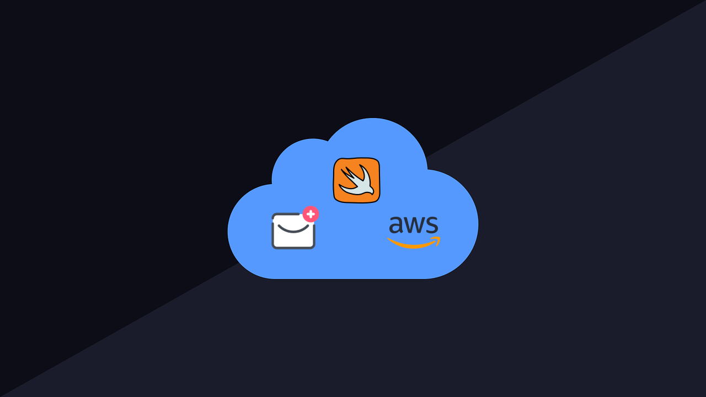

<h1 align="center">
    
</h1>

<h3 align="center">
  Cloud Chat: iOS Application
</h3>

“Não espere para plantar, apenas tenha paciência para colher”!</blockquote>

  

  

  

  

  

  

  <a href="#rocket-descrição">Descrição</a>&nbsp;&nbsp;&nbsp;|&nbsp;&nbsp;&nbsp;
  <a href="#computer-tecnologias-e-ferramentas">Tecnologias e Ferramentas</a>&nbsp;&nbsp;&nbsp;|&nbsp;&nbsp;&nbsp;
  <a href="#iphone-screenshot">Screenshot</a>&nbsp;&nbsp;&nbsp;|&nbsp;&nbsp;&nbsp;
  <a href="#movie_camera-preview">Preview</a>&nbsp;&nbsp;&nbsp;|&nbsp;&nbsp;&nbsp;
  <a href="#memo-licença">Licença</a>

## :rocket: Descrição

O Cloud Chat é um aplicativo de conversas, onde é possível escolher um amigo em uma lista de contatos, iniciar a conversa via texto e enviar imagens.

A aplicação utiliza a infraestrutura da Amazon AWS, serviços como [AWSCognito](https://aws.amazon.com/pt/cognito/), [AWSDynamoDB](https://pixel.everesttech.net/4422/cq?ev_sid=3&ev_ln=dynamodb%20aws&ev_lx=kwd-64246267482&ev_crx=89108950468&ev_mt=e&ev_n=g&ev_ltx=&ev_pl=&ev_pos=&ev_dvc=c&ev_dvm=&ev_phy=1001773&ev_loc=&ev_cx=377183548&ev_ax=22645460548&ev_efid=Cj0KCQjwpLfzBRCRARIsAHuj6qVR2RNZyhIV60iY3EUubEqErSUeiM6xSRwzxeiHlvACrjh98YO07yEaAiPqEALw_wcB:G:s&url=http://aws.amazon.com/dynamodb/%3Fsc_channel%3DPS%26sc_campaign%3Dacquisition_BR%26sc_publisher%3Dgoogle%26sc_medium%3Denglish_dynamodb_b%26sc_content%3Ddynamodb_e%26sc_detail%3Ddynamodb%2520aws%26sc_category%3Ddynamodb%26sc_segment%3D89108950468%26sc_matchtype%3De%26sc_country%3DBR%26s_kwcid%3DAL!4422!3!89108950468!e!!g!!dynamodb%2520aws%26ef_id%3DCj0KCQjwpLfzBRCRARIsAHuj6qVR2RNZyhIV60iY3EUubEqErSUeiM6xSRwzxeiHlvACrjh98YO07yEaAiPqEALw_wcB:G:s), [AWSS3](https://aws.amazon.com/s3/?sc_channel=PS&sc_campaign=acquisition_BR&sc_publisher=google&sc_medium=english_s3_b&sc_content=s3_e&sc_detail=aws%20s3&sc_category=s3&sc_segment=89108864428&sc_matchtype=e&sc_country=BR&s_kwcid=AL!4422!3!89108864428!e!!g!!aws%20s3&ef_id=Cj0KCQjwpLfzBRCRARIsAHuj6qUVrOSIgG-c0fpiDg13sNmO6CtOYEBfW6VVRsWUXwmdDZMSSDWYyowaAhgjEALw_wcB:G:s) e [AWSLambda](https://aws.amazon.com/pt/lambda/).
Esses serviços são acessíveis através do AWSSDK iOS ou Android.

## :computer: Tecnologias e Ferramentas

- [Swift](https://www.apple.com/br/swift/)
- [AWS SDK](https://aws.amazon.com/pt/tools/)
- [AWS Cognito](https://aws.amazon.com/pt/cognito/)
- [AWS DynamoDB](https://pixel.everesttech.net/4422/cq?ev_sid=3&ev_ln=dynamodb%20aws&ev_lx=kwd-64246267482&ev_crx=89108950468&ev_mt=e&ev_n=g&ev_ltx=&ev_pl=&ev_pos=&ev_dvc=c&ev_dvm=&ev_phy=1001773&ev_loc=&ev_cx=377183548&ev_ax=22645460548&ev_efid=Cj0KCQjwpLfzBRCRARIsAHuj6qVR2RNZyhIV60iY3EUubEqErSUeiM6xSRwzxeiHlvACrjh98YO07yEaAiPqEALw_wcB:G:s&url=http://aws.amazon.com/dynamodb/%3Fsc_channel%3DPS%26sc_campaign%3Dacquisition_BR%26sc_publisher%3Dgoogle%26sc_medium%3Denglish_dynamodb_b%26sc_content%3Ddynamodb_e%26sc_detail%3Ddynamodb%2520aws%26sc_category%3Ddynamodb%26sc_segment%3D89108950468%26sc_matchtype%3De%26sc_country%3DBR%26s_kwcid%3DAL!4422!3!89108950468!e!!g!!dynamodb%2520aws%26ef_id%3DCj0KCQjwpLfzBRCRARIsAHuj6qVR2RNZyhIV60iY3EUubEqErSUeiM6xSRwzxeiHlvACrjh98YO07yEaAiPqEALw_wcB:G:s)
- [AWS S3](https://aws.amazon.com/s3/?sc_channel=PS&sc_campaign=acquisition_BR&sc_publisher=google&sc_medium=english_s3_b&sc_content=s3_e&sc_detail=aws%20s3&sc_category=s3&sc_segment=89108864428&sc_matchtype=e&sc_country=BR&s_kwcid=AL!4422!3!89108864428!e!!g!!aws%20s3&ef_id=Cj0KCQjwpLfzBRCRARIsAHuj6qUVrOSIgG-c0fpiDg13sNmO6CtOYEBfW6VVRsWUXwmdDZMSSDWYyowaAhgjEALw_wcB:G:s)
- [AWS Lambda](https://aws.amazon.com/pt/lambda/)

## :iphone: Screenshot

<h2 align="center">
  
  
  
  
  
  
  
  
</h2>

## :memo: Licença

Esse projeto está sob a licença MIT. Veja o arquivo [LICENSE](LICENSE) para mais detalhes.

---

Projeto desenvolvido by Igor Clemente :wave:
